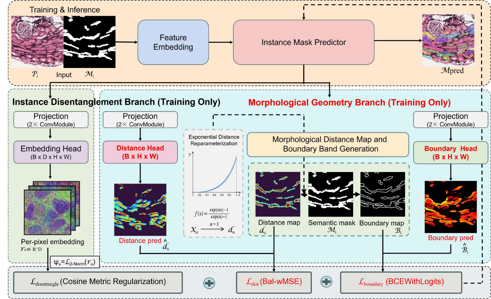

# MORI-seg: Object-Aware RTMDet-Ins for Renal Pathology Instance Segmentation

MORI-seg is an instance segmentation model for renal pathology: RTMDet-Ins-L extended with Object-Aware auxiliary branches (distance / embedding / boundary band), implemented as an **MMDetection plugin**. <br />

<br />

**MORI-Seg Paper** <br />
> [MORI-Seg: Learning Morphological Geometry for Instance Segmentation without Instance Annotations](https://arxiv.org/abs/2605.28261) <br />
> Leiyue Zhao, Tianyu Shi, Daniel Reisenbuchler, Xinzi He, Junchao Zhu, Tianyuan Yao, Yuechen Yang, Yanfan Zhu, Junlin Guo, Gelei Xu, Haichun Yang, Yuankai Huo, Mert R. Sabuncu, Yihe Yang, Ruining Deng. <br />
> *arXiv:2605.28261* <br />

## Abstract

Instance segmentation on renal pathology images is difficult because objects are dense and touching: tubules form connected sheets and peritubular capillaries are small and tightly packed, so neighbouring instances are easily merged into one. MORI-seg attaches two **training-only** branches to the instance mask predictor of RTMDet-Ins:

- **Instance Disentanglement Branch** — a per-pixel embedding head supervised by a cosine metric regularization `L_disentangle`, pulling pixels of one instance together and pushing neighbouring instances apart.
- **Morphological Geometry Branch** — a distance head supervised by an exponentially reparameterized distance map (`L_dist`, balanced weighted MSE) and a boundary head supervised by the boundary band derived from the semantic mask (`L_boundary`, BCEWithLogits).

Both branches are dropped at inference, so the inference path stays identical to stock RTMDet-Ins.

## Quick Start

```bash
cd MORI-seg
export TEST_ROOT=/path/to/test_dataset     # test set root
bash scripts/eval.sh --devices cuda:0,cuda:0,cuda:0,cuda:1
```

This runs `checkpoint/Mori_seg.pth` over the test set and writes results to `work_dirs/eval/Mori_seg/`.

## Installation

This repository **does not contain mmdetection itself** — it only provides the model code and configs that register into MMDetection. Please refer to [MMDetection GitHub](https://github.com/open-mmlab/mmdetection) and [get_started](https://mmdetection.readthedocs.io/en/latest/get_started.html) for full installation instructions.

```bash
conda create -n mori-seg python=3.10 -y
conda activate mori-seg

pip install torch==2.1.0 torchvision==0.16.0 --index-url https://download.pytorch.org/whl/cu118

pip install -U openmim
mim install mmengine==0.10.7
mim install mmcv==2.1.0
mim install mmdet==3.3.0

pip install pycocotools opencv-python tqdm
```

## Model

Download the pretrained weights from [Google Drive](<LINK>) and place the file at `checkpoint/Mori_seg.pth`.

## Training

```bash
python tools/train.py configs/mori_seg.py
```

Set `data_root` in the config to your COCO-format dataset (6 classes: `cap, dt, pt, ptc, tuft, ves`). Output goes to `work_dirs/mori_seg/`.

## Evaluation

#### 4-class mapping evaluation

```bash
# default checkpoint, 4 shards (3 on cuda:0, 1 on cuda:1)
bash scripts/eval.sh --devices cuda:0,cuda:0,cuda:0,cuda:1

# another checkpoint
bash scripts/eval.sh --checkpoint path/to/epoch_100.pth --devices cuda:0
```

The 6 training classes are mapped to 4 evaluation classes (`cap → glomeruli`, `dt, pt → tubules`, `ptc → peritubular-capillaries`, `ves → arteries`, `tuft` dropped); 10x images are scored for glomeruli / tubules / arteries and 40x images for ptc. Mapping rules are in `mori_seg/eval/category_spaces.json`.

Everything is written to the output directory, by default `work_dirs/eval/<checkpoint name>/`:

| Output | Content |
|---|---|
| `eval_results_<name>.json` | overall and per-class AP / AP50 / AP75, semantic IoU / Dice, F1 / precision / recall, and the 10x / 40x image counts |
| `per_image_metrics_<name>.csv` | the same metrics for every test image |
| `<name>_predictions.ndjson` | all predictions, one JSON object per line: `image_id`, `category_id`, `score`, RLE `segmentation` |
| `<name>_shard{0..N}_predictions.ndjson` | per-shard predictions; safe to delete once merged |
| `coco_stdout.txt` | the raw COCOeval summary table |
| `logs/infer_shard*.log`, `logs/eval.log` | inference and evaluation logs |

The console prints the COCOeval table, the overall mAP / AP50 / AP75, and the per-class semantic IoU / Dice and F1.

#### 6-class COCO evaluation

```bash
python tools/test.py configs/mori_seg.py <CHECKPOINT>
```

## Acknowledgments

We are grateful to the teams whose work this project builds on:

- [MMDetection](https://github.com/open-mmlab/mmdetection) and [RTMDet](https://github.com/open-mmlab/mmdetection/tree/main/configs/rtmdet), for the detection framework and the baseline detector.
- [Object-aware Embedding (Chen et al., MICCAI 2019)](https://arxiv.org/abs/2004.09821), whose local-constraint embedding inspired the instance disentanglement branch.
- The [KI dataset](http://haeckel.case.edu/data/KI_data/), derived from the [NEPTUNE](https://www.neptune-study.org/) study, used for training.
- The [Kidney Precision Medicine Project (KPMP)](https://www.kpmp.org/) and its [Kidney Tissue Atlas](https://atlas.kpmp.org/), used for external evaluation.

Our thanks go to the patients who contributed tissue, and to the investigators and annotators who made these resources openly available. We wish everyone building on them every success.

## Citation

If you use this project, please cite:

```bibtex
@misc{zhao2026moriseglearningmorphologicalgeometry,
      title={MORI-Seg: Learning Morphological Geometry for Instance Segmentation without Instance Annotations}, 
      author={Leiyue Zhao and Tianyu Shi and Daniel Reisenbuchler and Xinzi He and Junchao Zhu and Tianyuan Yao and Yuechen Yang and Yanfan Zhu and Junlin Guo and Gelei Xu and Haichun Yang and Yuankai Huo and Mert R. Sabuncu and Yihe Yang and Ruining Deng},
      year={2026},
      eprint={2605.28261},
      archivePrefix={arXiv},
      primaryClass={cs.CV},
      url={https://arxiv.org/abs/2605.28261}, 
}
```
