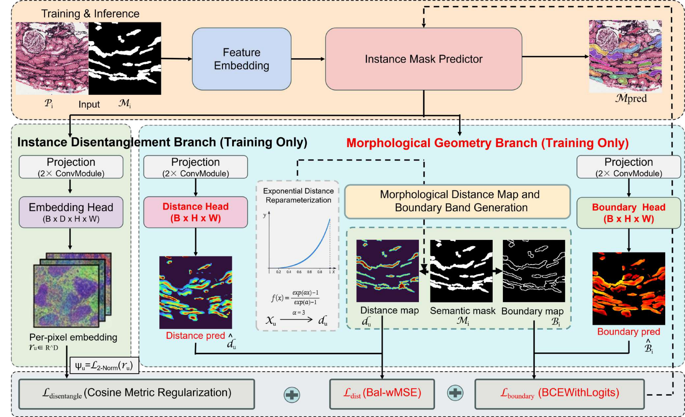

# MORI-seg: Object-Aware RTMDet-Ins for Renal Pathology Instance Segmentation

MORI-seg is an instance segmentation model for renal pathology: RTMDet-Ins-L extended with Object-Aware auxiliary branches (distance / embedding / boundary band), implemented as an **MMDetection plugin**. <br />

<br />

**MORI-Seg Paper** <br />
> [MORI-Seg: Learning Morphological Geometry for Instance Segmentation without Instance Annotations](https://arxiv.org/abs/2605.28261) <br />
> Leiyue Zhao, Tianyu Shi, Daniel Reisenbuchler, Xinzi He, Junchao Zhu, Tianyuan Yao, Yuechen Yang, Yanfan Zhu, Junlin Guo, Gelei Xu, Haichun Yang, Yuankai Huo, Mert R. Sabuncu, Yihe Yang, Ruining Deng. <br />
> *arXiv:2605.28261* <br />

## Abstract

Instance segmentation on renal pathology images is difficult because objects are dense and touching: tubules form connected sheets and peritubular capillaries are small and tightly packed, so neighbouring instances are easily merged into one. MORI-seg attaches two **training-only** branches to the instance mask predictor of RTMDet-Ins:

- **Instance Disentanglement Branch** — a per-pixel embedding head supervised by a cosine metric regularization `L_disentangle`, pulling pixels of one instance together and pushing neighbouring instances apart.
- **Morphological Geometry Branch** — a distance head supervised by an exponentially reparameterized distance map (`L_dist`, balanced weighted MSE) and a boundary head supervised by the boundary band derived from the semantic mask (`L_boundary`, BCEWithLogits).

Both branches are dropped at inference, so the inference path stays identical to stock RTMDet-Ins.

## Quick Start

Evaluating the released weights on a test set takes four steps.

**1. Get the code and the environment.** See [Installation](#installation) for the full dependency list; in short, an MMDetection 3.3.0 environment.

```bash
git clone https://github.com/Zitherstring/mori.git MORI-seg
cd MORI-seg
conda activate mori-seg
```

**2. Get the weights.** Download `Mori_seg.pth` (see [Model](#model)) and put it where the scripts expect it:

```bash
mkdir -p checkpoint
mv /path/to/Mori_seg.pth checkpoint/Mori_seg.pth
```

**3. Point `TEST_ROOT` at the test set.** It must be COCO-format and laid out as described in [Data](#data):

```
$TEST_ROOT/
├── annotations/
│   ├── test.json            # image list for inference
│   └── test_instance.json   # ground truth for scoring
└── images/test/
```

```bash
export TEST_ROOT=/path/to/test_dataset
```

**4. Run the evaluation.**

```bash
bash scripts/eval.sh
```

The script shards inference over the test images, merges the shard predictions and scores them in the 4-class space. Progress is printed per shard; a full run of ~9k images takes roughly an hour on a single GPU.

When it finishes it prints the overall mAP / AP50 / AP75 followed by per-category AP, F1 and semantic IoU. The same numbers, plus per-image metrics and the raw predictions, are written to `work_dirs/eval/Mori_seg/` (see [Evaluation](#evaluation)).

Useful variations:

```bash
# split inference across processes / GPUs, one comma-separated device per process
bash scripts/eval.sh --devices <DEV>,<DEV>

# evaluate a checkpoint of your own
bash scripts/eval.sh --checkpoint path/to/your.pth

# mixed precision: faster, with tiny numerical differences
bash scripts/eval.sh --amp
```

## Installation

This repository **does not contain mmdetection itself** — it only provides the model code and configs that register into MMDetection. Please refer to [MMDetection GitHub](https://github.com/open-mmlab/mmdetection) and [get_started](https://mmdetection.readthedocs.io/en/latest/get_started.html) for full installation instructions.

```bash
conda create -n mori-seg python=3.10 -y
conda activate mori-seg

# PyTorch matching your CUDA toolkit
pip install torch==2.1.0 torchvision==0.16.0 --index-url https://download.pytorch.org/whl/cu118

# OpenMMLab packages; mim picks a pre-built mmcv wheel when one matches your
# torch/CUDA pair, and compiles it from source otherwise
pip install -U openmim
mim install mmengine==0.10.7
mim install mmcv==2.1.0
mim install mmdet==3.3.0

# remaining dependencies
pip install -r requirements.txt
```

Reference environment: Python 3.10.6, torch 2.1.0+cu118, torchvision 0.16.0+cu118, CUDA 11.8, cuDNN 8.7, mmengine 0.10.7, mmcv 2.1.0, mmdet 3.3.0, numpy 1.26.4, OpenCV 4.10.0, pycocotools 2.0.10.

## Model

Download the pretrained weights from [Google Drive](https://drive.google.com/file/d/1ONy565n3-B7m-rDNknhQ_QtO2Na5E8X1/view?usp=drive_link) and place the file at `checkpoint/Mori_seg.pth`.

## Data

Both training and evaluation read COCO-format instance annotations. Segmentations may be polygons or RLE; the training pipeline keeps them as polygons (`poly2mask=False`).

#### Classes

The model is trained on six renal structures and evaluated on four, because two tubule subtypes are merged and the glomerular tuft is not part of the evaluation space:

| Training class | Meaning | Evaluation class |
|---|---|---|
| `cap` | glomerular capsule | `non-globally-sclerotic_glomeruli` |
| `dt` | distal tubule | `tubules` |
| `pt` | proximal tubule | `tubules` |
| `ptc` | peritubular capillary | `peritubular-capillaries` |
| `tuft` | glomerular tuft | dropped |
| `ves` | vessel / artery | `arteries_arterioles` |

Training annotations use the six class names above, in this order (`category_id` 1-6). Evaluation ground truth uses the four evaluation class names. The mapping lives in `mori_seg/eval/category_spaces.json`.

#### Training set

```
<data_root>/
├── annotations/
│   ├── train.json
│   └── val.json
├── train/images/
└── val/images/
```

`data_root` is set in `configs/mori_seg.py`; `file_name` in each JSON is resolved relative to the matching `images/` directory. Images with no annotations, and images smaller than 32px, are skipped during training. Inputs are resized to 640x640 (`keep_ratio=True`) with padding.

#### Test set

```
$TEST_ROOT/
├── annotations/
│   ├── test.json            # image list for inference
│   └── test_instance.json   # ground truth for scoring
└── images/test/
```

`test.json` only needs the `images` entries (`id`, `file_name`, `width`, `height`); `test_instance.json` additionally needs `annotations` and `categories` in the four-class space.

#### Magnification

Evaluation is magnification-aware: 10x images are scored for arteries, glomeruli and tubules, 40x images only for peritubular capillaries. The magnification is read from `file_name`, which must therefore encode it in one of two ways:

- a prefix, `10x/...` or `40x/...`
- a size suffix, `..._2048x2048.png` for 10x or `..._512x512.png` for 40x

Anything else counts as `unknown` and is scored against all four classes.

## Training

```bash
python tools/train.py configs/mori_seg.py
```

Set `data_root` in the config to your COCO-format dataset (6 classes: `cap, dt, pt, ptc, tuft, ves`). Output goes to `work_dirs/mori_seg/`.

## Evaluation

#### 4-class mapping evaluation

```bash
# default checkpoint, single GPU
bash scripts/eval.sh

# another checkpoint
bash scripts/eval.sh --checkpoint path/to/epoch_100.pth
```

Inference can be sharded over several processes with `--devices`, taking one comma-separated device per process.

The 6 training classes are mapped to 4 evaluation classes (`cap → glomeruli`, `dt, pt → tubules`, `ptc → peritubular-capillaries`, `ves → arteries`, `tuft` dropped); 10x images are scored for glomeruli / tubules / arteries and 40x images for ptc. Mapping rules are in `mori_seg/eval/category_spaces.json`.

Everything is written to the output directory, by default `work_dirs/eval/<checkpoint name>/`:

| Output | Content |
|---|---|
| `eval_results_<name>.json` | overall and per-class AP / AP50 / AP75, semantic IoU / Dice, F1 / precision / recall, and the 10x / 40x image counts |
| `per_image_metrics_<name>.csv` | the same metrics for every test image |
| `<name>_predictions.ndjson` | all predictions, one JSON object per line: `image_id`, `category_id`, `score`, RLE `segmentation` |
| `<name>_shard{0..N}_predictions.ndjson` | per-shard predictions; safe to delete once merged |
| `coco_stdout.txt` | the raw COCOeval summary table |
| `logs/infer_shard*.log`, `logs/eval.log` | inference and evaluation logs |

Intermediate maps can be exported for visualisation: pass `--export-aux-map` (and optionally `--aux-map-dir`) to `mori_seg/eval/inference.py` to dump the per-pixel distance, embedding and boundary maps predicted by the auxiliary branches.

The console prints the COCOeval table, the overall mAP / AP50 / AP75, and the per-class semantic IoU / Dice and F1.

#### 6-class COCO evaluation

```bash
python tools/test.py configs/mori_seg.py <CHECKPOINT>
```

## Acknowledgments

We are grateful to the teams whose work this project builds on:

- [MMDetection](https://github.com/open-mmlab/mmdetection) and [RTMDet](https://github.com/open-mmlab/mmdetection/tree/main/configs/rtmdet), for the detection framework and the baseline detector.
- [Object-aware Embedding (Chen et al., MICCAI 2019)](https://arxiv.org/abs/2004.09821), whose local-constraint embedding inspired the instance disentanglement branch.
- The [KI dataset](http://haeckel.case.edu/data/KI_data/), derived from the [NEPTUNE](https://www.neptune-study.org/) study, used for training.
- The [Kidney Precision Medicine Project (KPMP)](https://www.kpmp.org/) and its [Kidney Tissue Atlas](https://atlas.kpmp.org/), used for external evaluation.

Our thanks go to the patients who contributed tissue, and to the investigators and annotators who made these resources openly available. We wish everyone building on them every success.

## License

MIT, see [LICENSE](LICENSE).

## Citation

If you use this project, please cite:

```bibtex
@misc{zhao2026moriseglearningmorphologicalgeometry,
      title={MORI-Seg: Learning Morphological Geometry for Instance Segmentation without Instance Annotations}, 
      author={Leiyue Zhao and Tianyu Shi and Daniel Reisenbuchler and Xinzi He and Junchao Zhu and Tianyuan Yao and Yuechen Yang and Yanfan Zhu and Junlin Guo and Gelei Xu and Haichun Yang and Yuankai Huo and Mert R. Sabuncu and Yihe Yang and Ruining Deng},
      year={2026},
      eprint={2605.28261},
      archivePrefix={arXiv},
      primaryClass={cs.CV},
      url={https://arxiv.org/abs/2605.28261}, 
}
```
